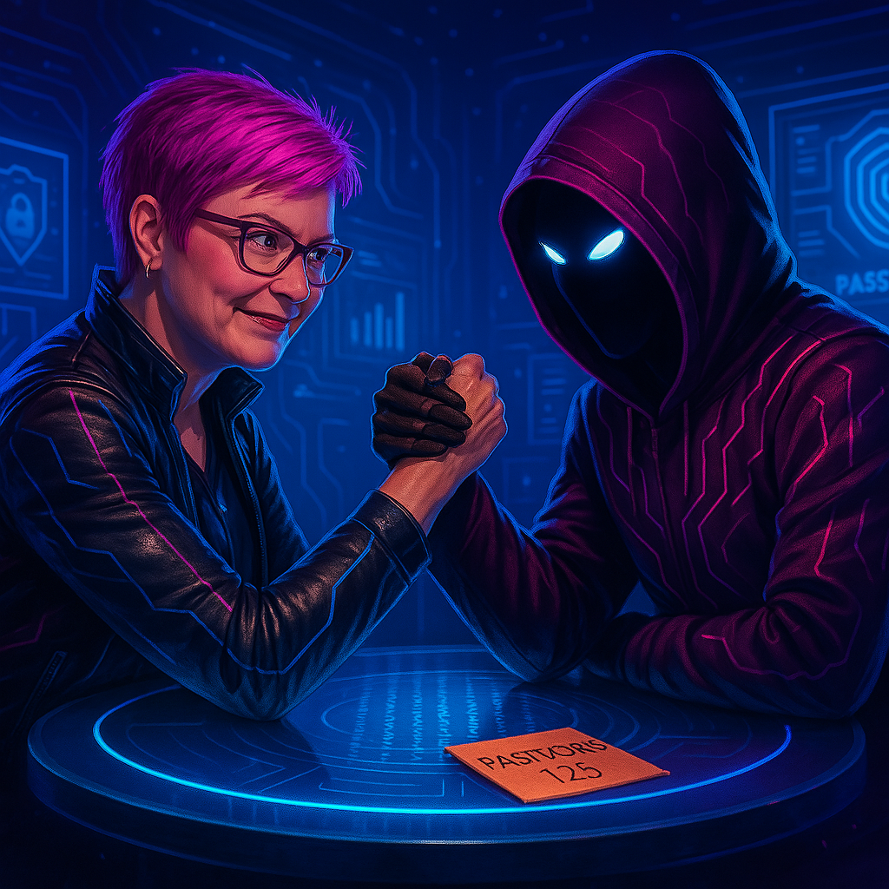
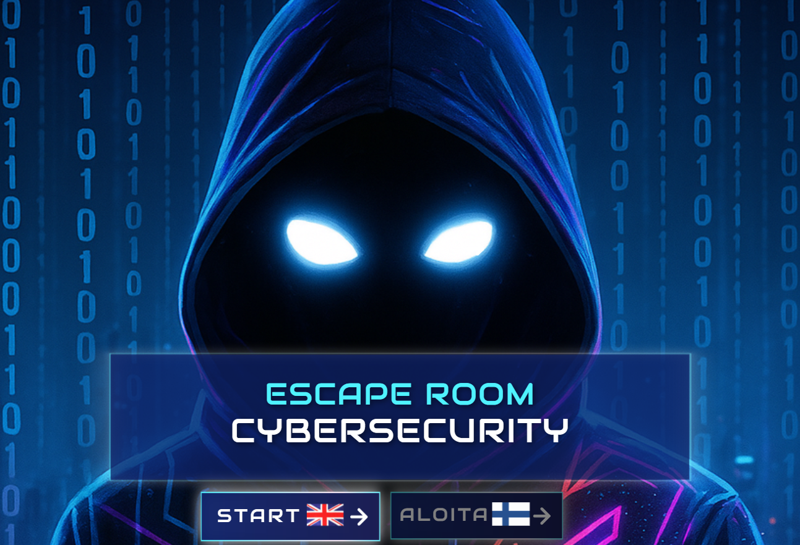
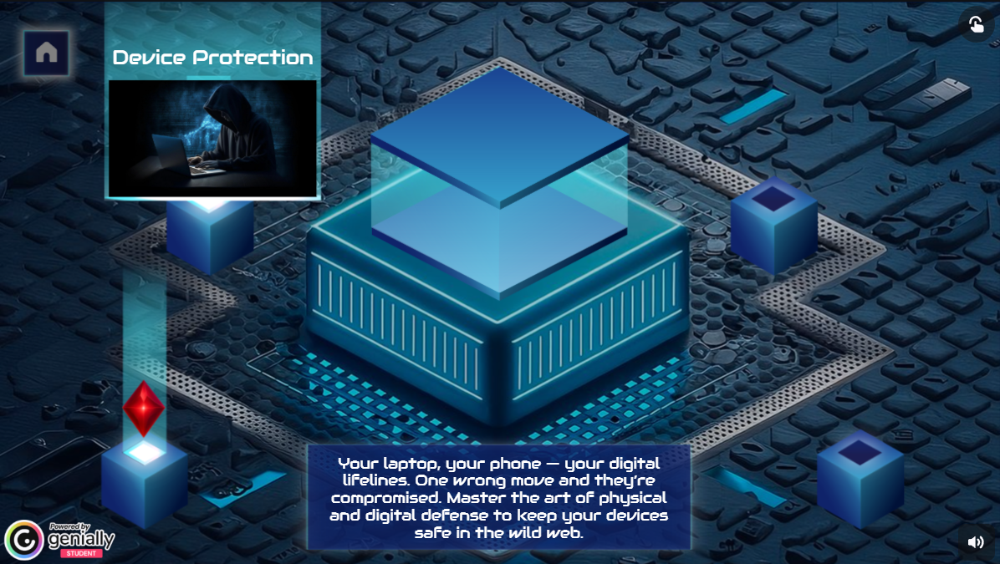
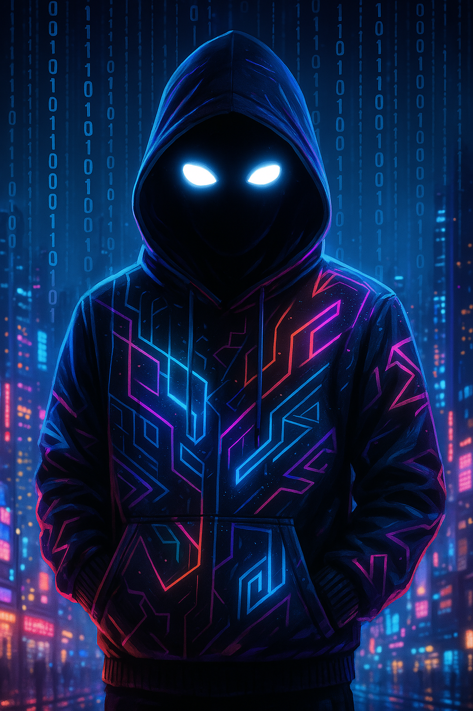

# 💠 Cyber Escape Room – Learn Cybersecurity Through Play

Welcome to the **Cyber Escape Room**, an interactive learning game designed to teach  
essential cybersecurity skills in a fun, visual and engaging way.

  

This project was created as part of the **SOC Specialist** training program.  
The assignment: create any type of presentation that illustrates cyber threats  
and how to avoid them. I chose a gamified escape room — because interactive  
learning fits my style and makes cybersecurity easier to understand.

---

## 🎮 Play the Escape Room

  

  

---

# 🧩 Rooms & Challenges

## 🔹 Cyber Lounge – Safe Surfing  

  

The Safe Surfing room introduces the foundations of secure online behavior.  
Players learn to evaluate the legitimacy of websites, emails and online content  
by identifying common indicators of trustworthiness and red flags that hint  
at social engineering.

Through drag-and-drop challenges, the player practices:

• verifying HTTPS and correct URL spelling  
• checking for contact information and privacy policies  
• assessing whether a site’s design, structure and content feel credible  
• recognizing exaggerated or emotional “clickbait”  
• identifying suspicious emails and verifying sender identity  
• avoiding unsafe Wi-Fi networks and confirming correct SSIDs  
• understanding cookie consent risks (“Accept all” vs. essential cookies)  
• evaluating viral giveaways for authenticity  
• checking app permissions, developer reputation and user reviews  

Humorous distractor options (such as trusting a site because it has a cat picture 🐱)  
reinforce critical thinking by contrasting safe practices with impulsive behavior.

At the end of the room, players receive a **concise summary of safe internet  
guidelines**, covering password hygiene, secure connections, software updates,  
email caution and logout practices. This reinforces the lessons learned and  
provides clear, actionable takeaways for everyday use.

---

## 🔹 Locker Room – Device Protection  

  

The Device Protection room focuses on safeguarding physical and digital devices  
against unauthorized access, data exposure and common endpoint vulnerabilities.  
Players learn how everyday habits - from locking screens to using secure  
authentication methods - directly impact the security of personal and  
organizational data.

Through multiple-choice challenges, the player practices:

• locking the workstation when stepping away, even briefly  
• understanding why sleep mode is insufficient as a security measure  
• recognizing the importance of regular updates for software, drivers and  
  operating systems to patch vulnerabilities  
• selecting the most secure mobile screen-lock methods (with biometrics offering  
  the strongest protection against unauthorized access)  
• using VPN connections to protect data on public Wi-Fi and prevent eavesdropping  
• identifying legitimate multi-factor authentication (MFA) factors such as  
  passwords, security tokens and biometrics  
• applying safe habits in public spaces — using privacy screens, avoiding  
  unattended devices and disabling automatic connection to open networks  

The room concludes with a **password and account security overview**, reinforcing  
key principles such as using unique passwords, storing them safely with password  
managers, avoiding predictable patterns, enabling MFA and updating credentials  
when compromise is suspected.

This room strengthens practical endpoint-security awareness and highlights how  
simple actions can drastically reduce the risk of device misuse and credential  
theft.

---

## 🔹 Password Control – Identity & Authentication  

  

The Identity at Risk room shifts the tone from general awareness to personal  
responsibility. Here, cybersecurity becomes directly connected to the player’s  
own digital identity. The room is presented as a fortified digital vault,  
accessible only to those who understand how to protect their credentials.

Unlike the previous rooms, this section introduces a narrative adversary - a  
masked figure who taunts the player, highlighting how curiosity, weak  
passwords and common habits can be exploited. Through this story-driven  
approach, the player sees firsthand how attackers think and why identity  
security requires constant vigilance.

The challenge segment focuses on strengthening core identity-protection skills,  
including:

• creating strong passphrases (16+ characters)  
• using complex, unpredictable password structures  
• assigning unique passwords to each account  
• recognizing poor password practices such as reuse or predictable patterns  
• identifying the most secure authentication factors (password + MFA + biometrics)  
• selecting secure mobile lock methods to prevent unauthorized access  
• evaluating app security and verifying trusted sources  
• responding safely to data breaches by changing passwords, enabling MFA  
  and monitoring account activity  

The room concludes with a mobile-security summary covering reliable security  
software, installing updates, permissions management, VPN use on public  
networks and safe app installation practices.

By blending narrative tension with hands-on decision making, this room teaches  
players how everyday identity-related choices influence their exposure to  
credential theft, impersonation and unauthorized access.

---

## 🔹 Digital Fallout – Data Breach Protocol  

  

The Data Breach Protocol room introduces players to organizational-level  
security risks, focusing on how cyber incidents occur, how they can be  
prevented, and how individuals contribute to a company’s overall security  
posture. The room uses an adversarial challenge format, symbolizing the  
constant struggle between defenders and attackers.

Through scenario-based questions and visual analysis tasks, the player learns  
to identify the root causes of data breaches, spot real-world vulnerabilities  
and make informed decisions under pressure.

Core skills practiced in this room include:

• recognizing common breach vectors such as weak or reused passwords, phishing  
  emails, outdated software and human error  
• analyzing workplace environments to spot risks like unlocked screens, visible  
  passwords and weak credential hygiene  
• applying preventive measures including regular updates, employee awareness  
  training, secure access controls and multi-factor authentication  
• identifying phishing attacks and knowing when to verify, report or delete  
  suspicious messages  
• understanding which types of data require encryption and strict protection  
  (personal data, login credentials, financial records)  
• evaluating the organizational impact of breaches, including reputational  
  damage, operational downtime, financial penalties and loss of intellectual  
  property  

The room concludes with a structured summary on phishing prevention and breach  
response, reinforcing best practices for verifying senders, using MFA, keeping  
backups and monitoring accounts for suspicious activity.

This section strengthens the player’s ability to recognize organizational  
threats and understand how individual actions contribute to or prevent major  
cyber incidents.

---

## 🔹 Final Challenge – Control System  

  

The final room, Control System, serves as the culmination of all previously  
learned cybersecurity principles. Access is unlocked only by entering the  
secret code obtained in the Data Breach Protocol room, reinforcing the  
importance of attention to detail and secure information handling.

Inside the control core, players face an eight-question mastery test designed  
to validate their understanding of secure online behavior, device protection,  
identity hygiene and organizational risk awareness. The visual atmosphere  
highlights the transition from virtual danger to regaining control of the  
system — and ultimately, returning to reality.

The player demonstrates competence in:

• identifying misconceptions about HTTPS and understanding its limitations  
• recognizing why accepting all cookies can introduce privacy and tracking risks  
• understanding physical-security habits such as locking the workstation  
  instead of relying on sleep mode  
• applying protective measures in public environments, including privacy  
  filters and safe handling of personal devices  
• evaluating password practices and knowing why regular updates still matter  
  even with strong credentials  
• applying multi-factor authentication consistently across accounts  
• acknowledging that data breaches affect the entire organization, not only IT  
• understanding that MFA remains effective even if a password is leaked  

Successful completion rewards the player with the **Master Cyber Crystal**,  
symbolizing full system control and mastery over the digital hazards encountered  
throughout the escape room.

This final section ties together all previous learning objectives and confirms  
that the player can apply cybersecurity best practices across real-world  
situations — from personal identity protection to organizational resilience.

---

## 🌟 Completion  

  

The Cyber Escape Room concludes with the activation of the Control System,  
signaling the player's full mastery of the skills needed to navigate digital  
threats. After progressing through five progressively challenging rooms,  
collecting all Cyber Crystals and unlocking the final system with the secret  
code, the player proves their resilience, awareness and decision-making ability  
in cybersecurity contexts.

Throughout the game, the player has:

• learned to identify trustworthy and suspicious online environments  
• recognized phishing attempts and responded to them safely  
• practiced secure device habits both in private and public settings  
• strengthened password and identity protection skills, including MFA  
• understood organizational risks and the impact of data breaches  
• applied critical thinking to real-world-inspired security scenarios  

By defeating the masked adversary and solving the Final Challenge, the player  
demonstrates not just theoretical understanding, but the practical ability to  
spot vulnerabilities, avoid traps and make informed choices under pressure.

The completion of the game symbolizes the transition from a passive user to an  
active defender - a Cyber Guardian capable of recognizing threats and safeguarding  
both personal and organizational information.

This finale brings the learning journey full circle, reinforcing the core  
message of the escape room: **cybersecurity is a skill you build one decision  
at a time.**

---

# 🎭 Characters

  
  

**Me:** The guide and narrator inside the escape room world - representing the learner  
who navigates through cybersecurity challenges.

**Cyberdude:** A symbolic adversary embodying digital threats, deception and  
the challenges users face when navigating unsafe online environments.

---

# ✨ About the Creator  
I’m Satu Ikola, a cybersecurity student specializing in Security Operations Center (SOC) work, Microsoft Security technologies and practical cyber defense. With a strong background in customer service, communication and organizational operations, I’m now transitioning fully into the cybersecurity field - combining human understanding with technical expertise.

I’m passionate about creating engaging, educational and visually immersive learning experiences, which led to the development of this Cyber Escape Room. My goal is to help people understand that cybersecurity doesn’t need to be intimidating - it can be clear, hands-on and even fun.

I aim to grow into a role where I can contribute to real-world defense:
🔹 SOC Analyst
🔹 Cybersecurity Specialist
🔹 Blue Team / Detection & Response
🔹 Microsoft Security Engineer (Sentinel, Defender XDR, Intune)

This project represents the beginning of that journey - a fusion of creativity, technical knowledge and a strong desire to help others become safer in the digital world.
